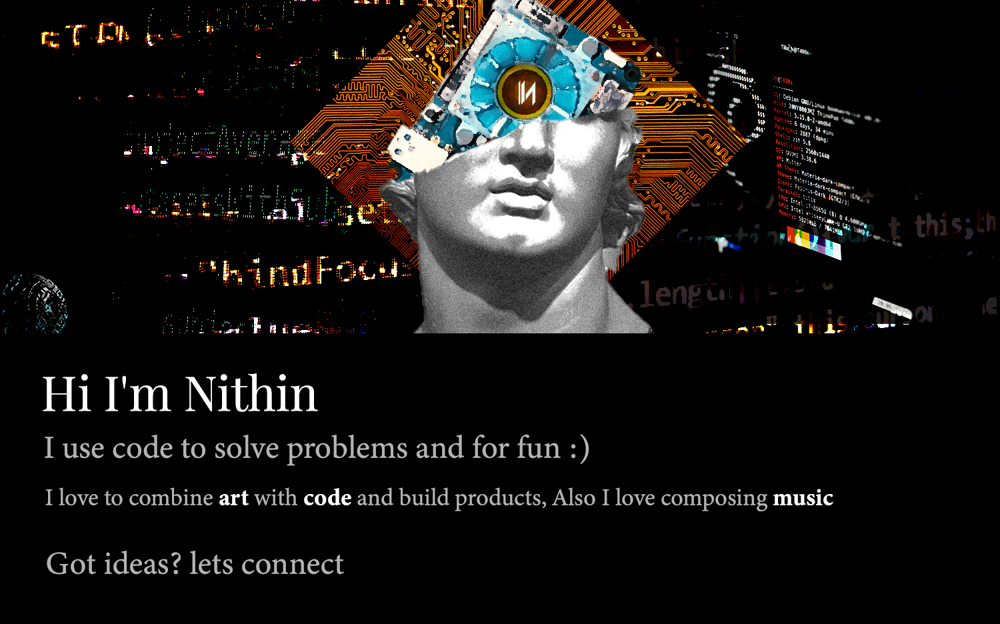

Hi I'm Nithin&nbsp;

I use code to solve problems and for fun :)

I love to combine <b class="text-white">art</b> with <b class="text-white">code</b> and build products, Also I love composing <b class="text-white">music</b>

Got ideas? lets connect

<a class="mr-5 cursor-pointer" target="_blank" href="https://twitter.com/RaphaelNithin"><svg xmlns="http://www.w3.org/2000/svg" class="text-gray-400 hover:fill-cyan-500" width="20" height="20" fill="currentColor" class="bi bi-twitter" viewBox="0 0 16 16"><path d="M5.026 15c6.038 0 9.341-5.003 9.341-9.334 0-.14 0-.282-.006-.422A6.685 6.685 0 0 0 16 3.542a6.658 6.658 0 0 1-1.889.518 3.301 3.301 0 0 0 1.447-1.817 6.533 6.533 0 0 1-2.087.793A3.286 3.286 0 0 0 7.875 6.03a9.325 9.325 0 0 1-6.767-3.429 3.289 3.289 0 0 0 1.018 4.382A3.323 3.323 0 0 1 .64 6.575v.045a3.288 3.288 0 0 0 2.632 3.218 3.203 3.203 0 0 1-.865.115 3.23 3.23 0 0 1-.614-.057 3.283 3.283 0 0 0 3.067 2.277A6.588 6.588 0 0 1 .78 13.58a6.32 6.32 0 0 1-.78-.045A9.344 9.344 0 0 0 5.026 15z"/></svg> </a><a class="mr-5 cursor-pointer" target="_blank" href="https://www.linkedin.com/in/nithinstephen/"><svg xmlns="http://www.w3.org/2000/svg" class="text-gray-400 hover:fill-blue-500" width="20" height="20" fill="currentColor" class="bi bi-linkedin" viewBox="0 0 16 16"><path d="M0 1.146C0 .513.526 0 1.175 0h13.65C15.474 0 16 .513 16 1.146v13.708c0 .633-.526 1.146-1.175 1.146H1.175C.526 16 0 15.487 0 14.854V1.146zm4.943 12.248V6.169H2.542v7.225h2.401zm-1.2-8.212c.837 0 1.358-.554 1.358-1.248-.015-.709-.52-1.248-1.342-1.248-.822 0-1.359.54-1.359 1.248 0 .694.521 1.248 1.327 1.248h.016zm4.908 8.212V9.359c0-.216.016-.432.08-.586.173-.431.568-.878 1.232-.878.869 0 1.216.662 1.216 1.634v3.865h2.401V9.25c0-2.22-1.184-3.252-2.764-3.252-1.274 0-1.845.7-2.165 1.193v.025h-.016a5.54 5.54 0 0 1 .016-.025V6.169h-2.4c.03.678 0 7.225 0 7.225h2.4z"/></svg> </a><a class="mr-5 cursor-pointer" href="https://www.instagram.com/nithinstephen96/" target="_blank"><svg xmlns="http://www.w3.org/2000/svg" class="text-gray-400 hover:fill-violet-500" width="20" height="20" fill="currentColor" class="bi bi-instagram" viewBox="0 0 16 16"><path d="M8 0C5.829 0 5.556.01 4.703.048 3.85.088 3.269.222 2.76.42a3.917 3.917 0 0 0-1.417.923A3.927 3.927 0 0 0 .42 2.76C.222 3.268.087 3.85.048 4.7.01 5.555 0 5.827 0 8.001c0 2.172.01 2.444.048 3.297.04.852.174 1.433.372 1.942.205.526.478.972.923 1.417.444.445.89.719 1.416.923.51.198 1.09.333 1.942.372C5.555 15.99 5.827 16 8 16s2.444-.01 3.298-.048c.851-.04 1.434-.174 1.943-.372a3.916 3.916 0 0 0 1.416-.923c.445-.445.718-.891.923-1.417.197-.509.332-1.09.372-1.942C15.99 10.445 16 10.173 16 8s-.01-2.445-.048-3.299c-.04-.851-.175-1.433-.372-1.941a3.926 3.926 0 0 0-.923-1.417A3.911 3.911 0 0 0 13.24.42c-.51-.198-1.092-.333-1.943-.372C10.443.01 10.172 0 7.998 0h.003zm-.717 1.442h.718c2.136 0 2.389.007 3.232.046.78.035 1.204.166 1.486.275.373.145.64.319.92.599.28.28.453.546.598.92.11.281.24.705.275 1.485.039.843.047 1.096.047 3.231s-.008 2.389-.047 3.232c-.035.78-.166 1.203-.275 1.485a2.47 2.47 0 0 1-.599.919c-.28.28-.546.453-.92.598-.28.11-.704.24-1.485.276-.843.038-1.096.047-3.232.047s-2.39-.009-3.233-.047c-.78-.036-1.203-.166-1.485-.276a2.478 2.478 0 0 1-.92-.598 2.48 2.48 0 0 1-.6-.92c-.109-.281-.24-.705-.275-1.485-.038-.843-.046-1.096-.046-3.233 0-2.136.008-2.388.046-3.231.036-.78.166-1.204.276-1.486.145-.373.319-.64.599-.92.28-.28.546-.453.92-.598.282-.11.705-.24 1.485-.276.738-.034 1.024-.044 2.515-.045v.002zm4.988 1.328a.96.96 0 1 0 0 1.92.96.96 0 0 0 0-1.92zm-4.27 1.122a4.109 4.109 0 1 0 0 8.217 4.109 4.109 0 0 0 0-8.217zm0 1.441a2.667 2.667 0 1 1 0 5.334 2.667 2.667 0 0 1 0-5.334z"/></svg></a>

